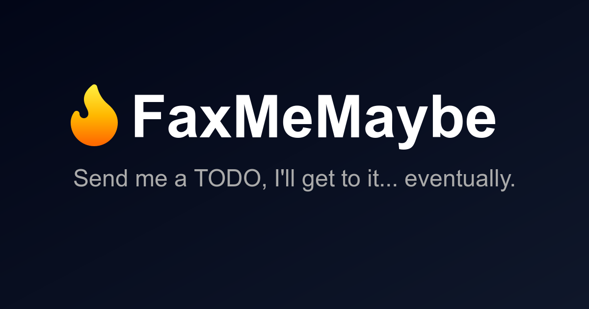

<div align="center">

# 🔥 FaxMeMaybe 🔥

### *Proof that you can learn by over-engineering silly ideas!*



[](https://workers.cloudflare.com/)
[](https://react.dev/)
[](https://www.typescriptlang.org/)
[](https://www.python.org/)
[](https://hono.dev/)

[](LICENSE)
[](https://github.com/features/actions)
[](https://aws.amazon.com/sqs/)
[](https://www.raspberrypi.org/)

*Inspired by [Laurie Hérault's article](https://www.laurieherault.com/articles/a-thermal-receipt-printer-cured-my-procrastination) and [Coding With Lewis' YouTube video](https://www.youtube.com/watch?v=xg45b8UXoZI)*

[Live Demo](https://remind.deadpackets.pw) • [Report Bug](https://github.com/deadpackets/FaxMeMaybe/issues) • [Request Feature](https://github.com/deadpackets/FaxMeMaybe/issues)

</div>

---

## 📖 Table of Contents

- [What is FaxMeMaybe?](#-what-is-faxmemaybe)
- [Why Is This Over-Engineered?](#-why-is-this-over-engineered)
- [Architecture Overview](#-architecture-overview)
- [Technology Explained (For Beginners)](#-technology-explained-for-beginners)
- [Features](#-features)
- [How It Works](#-how-it-works)
- [Project Structure](#-project-structure)
- [Configuration](#-configuration)
- [Usage](#-usage)
- [Contributing](#-contributing)
- [License](#-license)
- [Acknowledgments](#-acknowledgments)

---

## 🎯 What is FaxMeMaybe?

FaxMeMaybe is a **purposefully over-engineered TODO and reminder system** that takes a simple concept, which is "send yourself a reminder", and turns it into a distributed, cloud-native, edge-computing masterpiece that physically prints your TODOs on thermal paper.

Instead of using a simple note-taking app, FaxMeMaybe:

1. 📝 Accepts TODOs through a beautiful web interface
2. 🌐 Runs on the edge using Cloudflare Workers
3. 🎨 Renders tickets using a headless browser (Puppeteer)
4. 💾 Stores data in Cloudflare D1 (SQLite at the edge)
5. 📤 Sends print jobs to AWS SQS
6. 🍓 Polls messages on a Raspberry Pi
7. 🖨️ Physically prints your TODO on a thermal printer

**This is engineering for the sake of engineering, and I have learned alot from it!** 🎉

---

## 🤔 Why build something so over-engineered?

Because we can! But also because it's a **fantastic learning project** that demonstrates:

- Modern web development practices
- Cloud infrastructure and edge computing
- Serverless architecture
- Message queue patterns
- Hardware integration
- CI/CD pipelines
- Full-stack development

I did not know most of these technologies before starting this project. By combining them into a single, silly application, I was able to learn how they all work together in a real-world scenario.

---

## 🏗️ Architecture Overview

```
┌─────────────────────────────────────────────────────────────────┐
│                          USER                                    │
│                            │                                     │
│                            ▼                                     │
│  ┌──────────────────────────────────────────────────────────┐  │
│  │         React Frontend (Vite + TypeScript)                │  │
│  │  • shadcn/ui components • Dark/Light mode • QR codes     │  │
│  └──────────────────────────────────────────────────────────┘  │
│                            │                                     │
│                            ▼                                     │
│  ┌──────────────────────────────────────────────────────────┐  │
│  │      Cloudflare Workers (Edge Runtime - Hono)            │  │
│  │  • API endpoints • Rate limiting • Authentication        │  │
│  └──────────────────────────────────────────────────────────┘  │
│            │                │                │                   │
│            ▼                ▼                ▼                   │
│  ┌─────────────┐  ┌─────────────┐  ┌─────────────┐            │
│  │  D1 Database│  │ R2 Storage  │  │  Puppeteer  │            │
│  │   (SQLite)  │  │  (Tickets)  │  │  (Headless) │            │
│  └─────────────┘  └─────────────┘  └─────────────┘            │
│                            │                                     │
│                            ▼                                     │
│                   ┌─────────────────┐                           │
│                   │    AWS SQS      │                           │
│                   │  Message Queue  │                           │
│                   └─────────────────┘                           │
│                            │                                     │
│                            ▼                                     │
│         ┌───────────────────────────────────┐                   │
│         │  Raspberry Pi Client (Python)     │                   │
│         │  • SQS Polling • Image Download   │                   │
│         └───────────────────────────────────┘                   │
│                            │                                     │
│                            ▼                                     │
│                   ┌─────────────────┐                           │
│                   │ Thermal Printer │                           │
│                   │   (USB Device)  │                           │
│                   └─────────────────┘                           │
│                                                                   │
│         ┌───────────────────────────────────┐                   │
│         │    GitHub Actions (CI/CD)         │                   │
│         │  • Auto-deploy on push            │                   │
│         └───────────────────────────────────┘                   │
└─────────────────────────────────────────────────────────────────┘
```

---

## 🎓 Technology Explained (For Beginners)

### Frontend Technologies

#### **React** 
A JavaScript library for building user interfaces. Think of it as LEGO blocks for websites — you build reusable components that work together.

#### **TypeScript**
JavaScript with superpowers! It adds type checking, which helps catch bugs before your code runs.

#### **Vite**
A super-fast build tool that bundles your code and makes development smooth. It's like a compiler that also serves your website.

#### **shadcn/ui**
Pre-built, beautiful UI components that follow modern design principles. Save time instead of building buttons and forms from scratch.

### Backend Technologies

#### **Cloudflare Workers**
Serverless code that runs at the "edge" (Cloudflare's data centers worldwide). Instead of renting a server, your code runs close to your users for ultra-low latency.

**Think of it as:** Your code living in the cloud, automatically scaling, and only charging you for what you use.

#### **Hono**
A lightweight web framework for Cloudflare Workers (similar to Express.js). It handles HTTP requests, routing, and middleware.

#### **Cloudflare D1**
A serverless SQL database built on SQLite. Your data lives at the edge, close to your users.

**Think of it as:** A spreadsheet in the cloud that you can query with SQL.

#### **Cloudflare R2**
Object storage (like Amazon S3) for storing files — in this case, rendered ticket images.

**Think of it as:** A hard drive in the cloud for storing files.

#### **Puppeteer**
A headless browser (Chrome without the visual interface) controlled by code. We use it to render web pages as images.

**Think of it as:** A robot that opens web pages and takes screenshots.

### Message Queue

#### **AWS SQS (Simple Queue Service)**
A message queue that acts as a buffer between the server and the printer client.

**Think of it as:** A reliable post office — you drop messages in, and they're guaranteed to be delivered to whoever is listening.

**Why use it?** 
- The server doesn't need to know if the printer is online
- Messages wait safely until the printer is ready
- Automatic retries if something fails

### Hardware Client

#### **Raspberry Pi**
A tiny, affordable computer (about the size of a credit card) running Linux. Perfect for IoT projects.

#### **Python**
A beginner-friendly programming language. Great for scripting, automation, and hardware control.

#### **python-escpos**
A Python library for controlling ESC/POS thermal printers (like receipt printers).

### DevOps

#### **GitHub Actions**
Automation for your code repository. Every time you push code, it automatically builds and deploys your project.

**Think of it as:** A robot assistant that tests and deploys your code whenever you make changes.

#### **CI/CD (Continuous Integration/Continuous Deployment)**
A practice where code changes are automatically tested and deployed. Push to `main` → Build → Test → Deploy. All automatic!

---

## ✨ Features

### 🌐 Web Interface
- ✅ Beautiful, responsive React UI with dark/light mode
- ✅ Real-time TODO submission with validation
- ✅ Importance levels (Low, Medium, High, Urgent, Critical) with 🔥 indicators
- ✅ Optional due dates and sender information
- ✅ Live counter showing total TODOs sent
- ✅ Admin dashboard for managing TODOs

### 🎫 Ticket System
- ✅ Automatic ticket generation with QR codes
- ✅ Printable ticket view optimized for thermal printers
- ✅ QR code leads to ViewTodo page for easy completion tracking
- ✅ Tickets stored as images in R2 storage

### 📱 ViewTodo Page
- ✅ Access TODO details via QR code or direct link
- ✅ Mark TODOs as complete with one click
- ✅ Beautiful themed UI matching the main app
- ✅ No authentication required (perfect for QR code access)

### 🛡️ Security & Performance
- ✅ Rate limiting (10 requests per minute)
- ✅ Input validation and sanitization
- ✅ CORS configuration
- ✅ Edge computing for global low latency
- ✅ SQLite database at the edge (D1)

### 🤖 Automation
- ✅ Automated deployments via GitHub Actions
- ✅ Automatic server rebuild on code changes
- ✅ SQS message polling on Raspberry Pi
- ✅ Automatic ticket rendering and storage

### 🖨️ Physical Printing
- ✅ USB thermal printer support
- ✅ Automatic paper size detection
- ✅ Image preprocessing for optimal print quality
- ✅ Error handling and retry logic

---

## 🔄 How It Works

### 1️⃣ **User Creates a TODO**
1. Visit `remind.deadpackets.pw`
2. Fill out the TODO form (importance, message, due date, sender)
3. Click "Send TODO"
4. The form validates input and sends a POST request to the API

### 2️⃣ **Server Processes the Request**
1. Cloudflare Worker receives the request
2. Rate limiting checks (max 10 per minute)
3. TODO is saved to D1 database with a unique UUID
4. A headless browser (Puppeteer) renders a ticket page as an image
5. The ticket image is uploaded to R2 storage
6. A message is sent to AWS SQS with the image URL

### 3️⃣ **Raspberry Pi Polls for Jobs**
1. Python client continuously polls SQS for new messages
2. When a message arrives, it downloads the ticket image
3. The image is preprocessed (resized, converted to 1-bit)
4. The USB thermal printer receives the data and prints!

### 4️⃣ **User Scans QR Code**
1. The printed ticket includes a QR code
2. Scanning it opens the ViewTodo page
3. User can see full TODO details
4. Clicking "Mark as Complete" updates the database
5. The TODO is now tracked as done!

---

## 📁 Project Structure

```
FaxMeMaybe/
├── 📂 fax-me-maybe-server/          # Cloudflare Workers backend + React frontend
│   ├── 📂 src/
│   │   ├── 📂 worker/               # Hono backend (TypeScript)
│   │   │   ├── index.ts             # Main API routes
│   │   │   ├── rate-limit.ts        # Rate limiting middleware
│   │   │   └── api.types.ts         # TypeScript type definitions
│   │   ├── 📂 react-app/            # React frontend
│   │   │   ├── App.tsx              # Main TODO submission page
│   │   │   ├── AdminDashboard.tsx   # Admin panel for managing TODOs
│   │   │   ├── TodoTicket.tsx       # Printable ticket view
│   │   │   ├── ViewTodo.tsx         # QR code accessible TODO viewer
│   │   │   └── main.tsx             # React router setup
│   │   ├── 📂 components/           # shadcn/ui components
│   │   │   └── ui/                  # Reusable UI components
│   │   └── 📂 lib/
│   │       └── utils.ts             # Utility functions
│   ├── 📂 public/                   # Static assets
│   │   ├── og-image.png             # OpenGraph preview image
│   │   └── flame.svg                # Logo/icon
│   ├── 📂 migrations/               # D1 database migrations
│   ├── package.json                 # Node.js dependencies
│   ├── wrangler.json                # Cloudflare Workers configuration
│   ├── vite.config.ts               # Vite build configuration
│   └── tsconfig.json                # TypeScript configuration
│
├── 📂 fax-me-maybe-client/          # Raspberry Pi printer client
│   ├── main.py                      # SQS polling and printer control
│   ├── pyproject.toml               # Python dependencies
│   ├── Dockerfile                   # Container configuration
│   └── docker-compose.yml           # Docker Compose setup
│
├── 📂 .github/
│   └── 📂 workflows/                # GitHub Actions CI/CD
│       ├── build-server-on-push.yml # Auto-deploy server
│       └── build-client-on-push.yml # Build client
│
├── LICENSE                          # MIT License
├── README.md                        # You are here! 👋
└── TODO.md                          # Project roadmap
```

---

## 🚀 Technologies Used

- **Node.js** 24+ (for the server)
- **Python** 3.14+ (for the client)
- **npm** or **yarn** (package manager)
- **Cloudflare account** (free tier works!)
- **AWS account** (for SQS)
- **Raspberry Pi** (optional, for physical printing)
- **USB Thermal Printer** (optional)

---

## ⚙️ Configuration

### Cloudflare Workers (wrangler.json)

- **`name`**: Your worker name
- **`compatibility_date`**: Cloudflare runtime version
- **`routes`**: Custom domain mapping
- **`d1_databases`**: Database binding
- **`r2_buckets`**: Storage binding
- **`browser`**: Puppeteer browser binding

### Rate Limiting

Edit `src/worker/rate-limit.ts`:
```typescript
simple: {
    limit: 10,      // Max requests
    period: 60      // Time window (seconds)
}
```

### AWS SQS

1. Create an SQS queue in AWS Console
2. Set visibility timeout to 60 seconds
3. Enable server-side encryption (optional)
4. Copy the queue URL to `.dev.vars`

---

## 📖 Usage

### Creating a TODO

1. Visit your deployed site (e.g., `remind.deadpackets.pw`)
2. Select importance level (🔥 Low → 🔥🔥🔥🔥🔥 Critical)
3. Enter your TODO message (max 64 characters)
4. (Optional) Set a due date
5. (Optional) Add your name in "From" field
6. Click **"Send TODO"**
7. Your TODO is now in the queue!

### Viewing TODOs (Admin)

1. Navigate to `/admin`
2. View all pending and completed TODOs
3. Filter by completion status
4. Mark items as complete/incomplete
5. Delete TODOs

### Accessing via QR Code

1. Print a TODO ticket
2. Scan the QR code with your phone
3. View full TODO details
4. Click "Mark as Complete" when done

### API Endpoints

#### Public Endpoints
```
POST   /api/todos                    # Create new TODO
GET    /api/todos/count              # Get total TODO count
GET    /api/todos/:id                # Get TODO by ID
GET    /api/todos/:id/complete       # Mark TODO as complete
```

#### Protected Endpoints (require auth)
```
GET    /api/todos                    # List all TODOs
PATCH  /api/todos/:id/incomplete     # Mark as incomplete
DELETE /api/todos/:id                # Delete TODO
```

---

## 🤝 Contributing

Contributions are welcome! This is a learning project, so don't be shy.

1. Fork the repository
2. Create your feature branch (`git checkout -b feature/AmazingFeature`)
3. Commit your changes (`git commit -m 'Add some AmazingFeature'`)
4. Push to the branch (`git push origin feature/AmazingFeature`)
5. Open a Pull Request

---

## 📄 License

This project is licensed under the MIT License - see the [LICENSE](LICENSE) file for details.

---

## 🙏 Acknowledgments

- **Laurie Hérault** - Original inspiration from ["A receipt printer cured my procrastination"](https://www.laurieherault.com/articles/a-thermal-receipt-printer-cured-my-procrastination)
- **Coding With Lewis** - YouTube tutorial that sparked the idea
- **Cloudflare** - For amazing edge computing tools
- **python-escpos** - For making thermal printer integration easy
- **shadcn/ui** - For beautiful, accessible components
- The open-source community ❤️

---

<div align="center">

### Made with ☕ and way too much engineering

**If you found this project helpful or entertaining, give it a ⭐!**

[Report Issues](https://github.com/deadpackets/FaxMeMaybe/issues) • [Request Features](https://github.com/deadpackets/FaxMeMaybe/issues)

</div>

